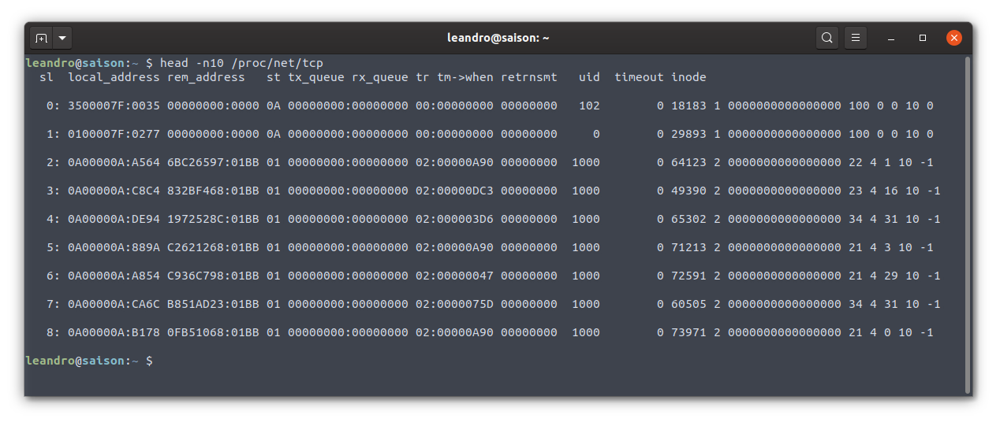
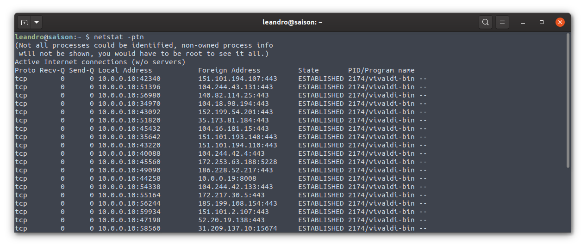
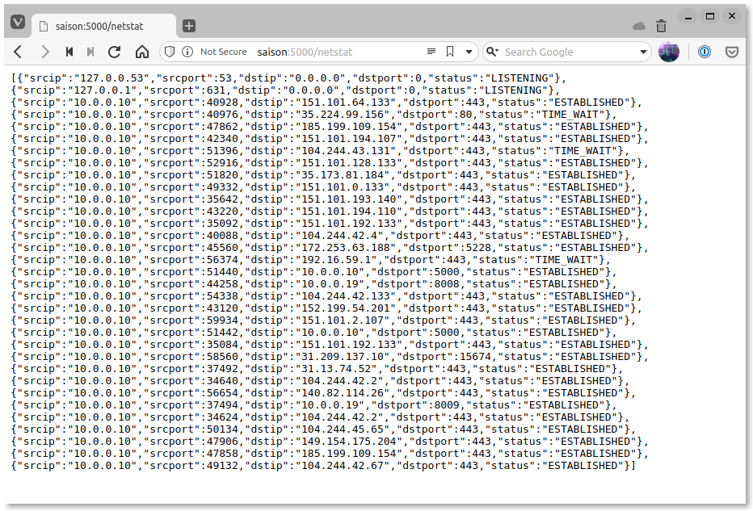

# go-sysmon

Essa API foi desenvolvida para aprender um pouco de Go e seu funcionamento é bem simples, ela emula o uso do `netstat` lendo o arquivo `/proc/net/tcp` e retornando as conexões em uma lista de objetos json.

### `/proc/net/tcp`

### netstat

### go-sysmon

## Funcionamento

A API por padrão escuta na porta `5000` e responde em dois endpoints.

- `/netstat` - retorna as conexões para todas as portas
- `/netstat/port` - retorna as conexões apenas para a porta especificada.

